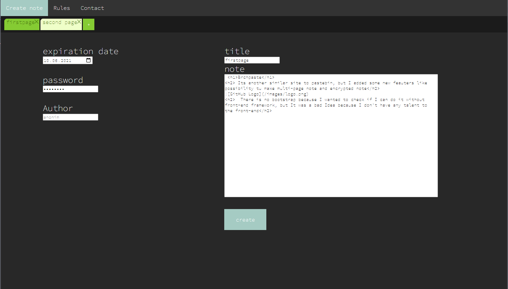
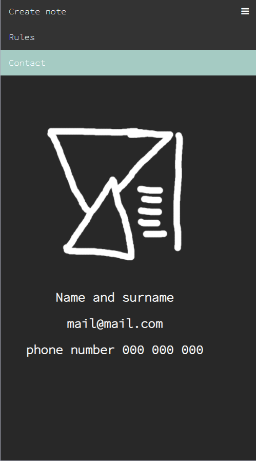

<h1>Brchpaste</h1>
<h2>  Its another similar site to pastebin, but I added some new features like possibility to make multi-page note and encrypted note There is no bootstrap because I wanted to check if I can do it without front-end framework, but It was a bad Idea because I don't have any talent to the front-end :/</h2>

  
  

<h3>I used here oop php and oop js with jquery and also I made very simple database base which contains 2 tables and 1 mysql event.
I didn't add such important things like recaptcha and js validation(there is php validation only) because recaptcha on localhost acts weirdly.
  I would also notice that this site is "kinda responsive", there is no footer because I think that it's useless.
</h3> 

